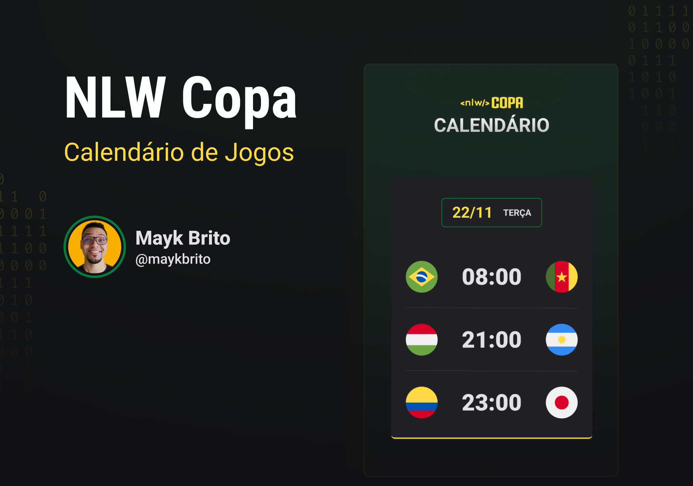

<h1 align="center"> Calendário de Jogos </h1>

<p align="center">
Evento exclusivo e gratuito, promovido pela Rocketseat para ensino de tecnologias WEB.
</p>

<p align="center">
  <a href="#--projeto">Projeto</a>&nbsp;&nbsp;&nbsp;|&nbsp;&nbsp;&nbsp;
  <a href="#--tecnologias">Tecnologias</a>&nbsp;&nbsp;&nbsp;|&nbsp;&nbsp;&nbsp;
  <a href="#--como-contribuir">Como Contribuir</a>&nbsp;&nbsp;&nbsp;|&nbsp;&nbsp;&nbsp;
  <a href="#--autor">Autor</a>&nbsp;&nbsp;&nbsp;|&nbsp;&nbsp;&nbsp;
  <a href="#--mostre-seu-apoio">Mostre seu apoio</a>&nbsp;&nbsp;&nbsp;|&nbsp;&nbsp;&nbsp;
  <a href="#memo--licença">Licença</a>
</p>

<p align="center">
  
</p>

<br>

<p align="center">
  
</p>

## 💻  Projeto

O Calendário de Jogos é um projeto que mostra os jogos da Copa do Mundo de 2022 com datas e hora. Desenvolvido durante o NLW-Copa na trilha explorer, evento organizado pela Rocketseat.

[Visite o projeto online](https://antonio2812.github.io/calendario-de-jogos)

## ⚡  Tecnologias

Esse projeto foi desenvolvido com as seguintes tecnologias:

- HTML5 e CSS3
- JavaScript
- Git e Github

## 🤝  Como Contribuir

```bash
  # Clone o projeto
  $ git clone https://github.com/antonio2812/calendario-de-jogos.git
````

```bash
  # Entrar no diretório
  $ cd calendario-de-jogos
```

```bash
  # Instale as dependências utilizando o npm
  $ npm install
```

```bash
  # Executar
  $ npm start
```

<p align="center">Ou</p>

```bash
  # Instale as dependências utilizando o yarn
  $ yarn
```

```bash
  # Executar
  $ yarn start
```

## 👤  Autor

**Antonio  Carlos**

* [Linkedin](https://www.linkedin.com/in/antonio-carlos-de-souza-junior-03783221b/)
* [Gmail](mailto:acarlosdesouzajunior@gmail.com)
* [Instagram](https://www.instagram.com/carlosdesouzajunior.antonio/)
* [Discord](https://discord.com/channels/@me)

## ✨  Mostre seu apoio

Dar uma⭐️se esse projeto te ajudou ou inspirou!

## :memo:  Licença

Esse projeto está sob a licença MIT. Consulte o arquivo <a href="https://github.com/antonio2812/calendario-de-jogos/blob/main/LICENSE">LICENSE</a> para mais detalhes.
